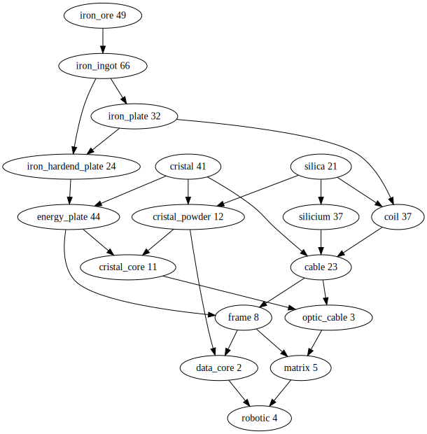
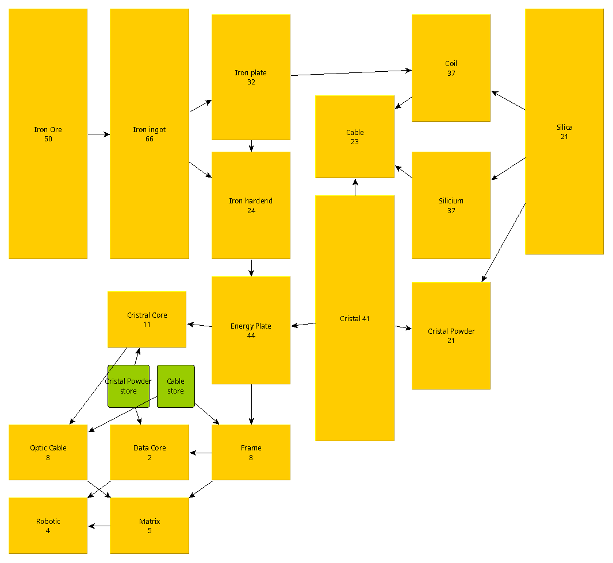

# desynced_calculator
A small script that calculates the required factories in Desynced and outputs them as a graphviz diagram.

I first created a hierarchy of the necessary factories in Desynced with the small Python script.
And then this generated by Graphviz:

Then I did the layout with yEd, because that way you can move the proportions and relationships around with the mouse and disentangle them.

btw: If someone finds a spelling mistake: Don't complain but correct it. This is a public repository!
